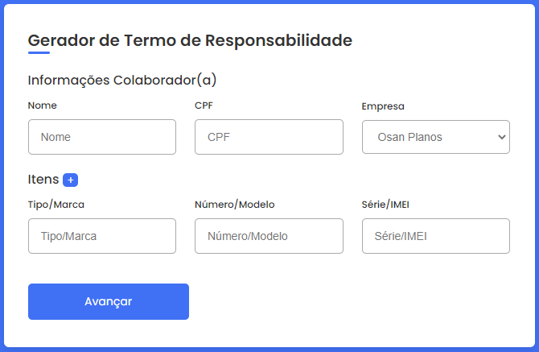
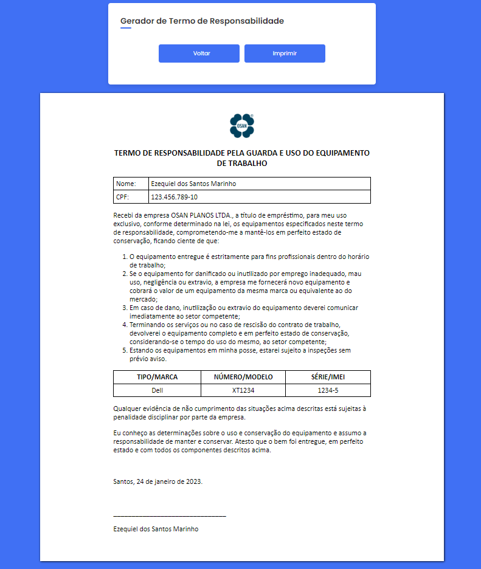

# termo-de-responsabilidade
Gerador de termo de responsabilidade, antes tínhamos um modelo no world, que devíamos editar manualmente e perdíamos tempo procurando o termo da empresa certa do grupo. Agora é só selecionar a empresa e inserir os dados do colaborador e os intens.

## _[Vizualizar o site](https://quelzynh0.github.io/termo-de-responsabilidade/)_

